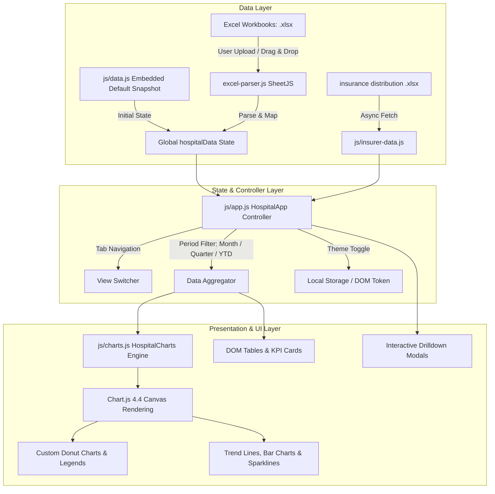

# Architecture Documentation — DMC Hospital Statistics Dashboard

## 1. Executive Summary
The **DMC Hospital Statistics & Performance Dashboard** is a zero-build, client-side web application designed to visualize and analyze clinical performance records from Dream Medical Center Hospital (2019–2026). It supports both pre-bundled default data and live dynamic drag-and-drop parsing of Excel workbooks.

---

## 2. System Architecture Diagram

---

## 3. Module Breakdown

### 3.1 Data Management Layer
- **`js/data.js`**: Contains the baseline `hospitalData` object (clinical departments, monthly arrays, metadata, C-Section rates, mortality incidents) and `HISTORICAL_MULTI_YEAR` data (2019–2024 longitudinal series).
- **`js/insurer-data.js`**: Asynchronously loads and normalizes insurance distribution records from November 2018 through September 2026, combining duplicate provider entries (e.g., standard vs RHIC branches).
- **`js/excel-parser.js`**: Wraps the SheetJS library (`XLSX`) to dynamically process uploaded spreadsheets. Detects:
  - Standard 2026 4-sheet monthly schema (`OUT PATIENT PER DEPARTEMENT`, `INPATIENT PER DEPARTEMENT`, `BABIES TOTAL`, `Death`).
  - 2025 12-month departmental schema (`OPD `, `IP`).
  - 2019–2024 annual longitudinal schema (`OPD`, `IP`).

### 3.2 Application Controller (`js/app.js`)
- **Initialization Lifecycle**: Theme initialization -> live clock -> year selector -> event binding -> workbook parser init -> chart rendering -> table population.
- **Tab State**: Manages 7 primary views:
  1. `overview`: High-level executive summary, key KPIs, inpatient/outpatient donuts, and monthly patient inflow trajectory.
  2. `inpatient`: Detailed ward breakdown, bed-occupancy/admission volumes, and ward table.
  3. `outpatient`: Outpatient specialty consultations, volume rankings, and full services table.
  4. `maternity`: C-Section vs SVD delivery split donut, historical delivery trend, and monthly metrics.
  5. `mortality`: In-facility death records, circumstance breakdown, and documented mortality log.
  6. `insurers`: Inpatient & outpatient payer share donuts, leading insurer horizontal bar charts, and tabular breakdowns.
  7. `historical`: Multi-year longitudinal comparative analysis (2019–2026).
- **Period Filter Engine**: Computes dynamic subsets for single months (0–7 for Jan–Aug), quarters (Q1, Q2), or year-to-date (All).
- **Drilldown Modal Engine**: `HospitalApp.showDepartmentDrilldown(type, deptName)` generates deep-dive analytics modals for inpatient wards, outpatient departments, delivery modes, and clinical mortalities.

### 3.3 Visualization Engine (`js/charts.js`)
- **Plugin Architecture**:
  - `donutCenterText`: Custom Chart.js canvas plugin rendering high-contrast centered metric numbers (`JetBrains Mono`) and category subtext (`Poppins`).
- **Standardized Donut Specification**:
  - Proportions: `cutout: '66%'`, `maintainAspectRatio: true`, `responsive: true`.
  - Styling: `borderWidth: 2`, theme-adaptive `borderColor` (`#FFFFFF` in light mode, `#1E1A18` in dark mode), `hoverOffset: 8`.
  - Custom Legend: Managed via `HospitalCharts.renderCustomLegend()`, creating accessible HTML grid legends with color dots, labels, formatted counts, and percentage pills.

---

## 4. Design System & CSS Structure
- **Theme Support**: Pure CSS variable token system via `data-theme="light"` and `data-theme="dark"` on `<html>`.
- **Color Palette**:
  - Brand Primary: `#E84A2D` (DMC Dream Red) / Dark Mode Accent: `#FF5E42`
  - Deep Charcoal: `#241E1C` / `#1E1A18`
  - Neutral Surfaces: `#FAF6F5` (Light surface) / `#2A2421` (Dark surface)
  - Semantic Status: `#10B981` (Positive / SVD), `#DC2626` (Danger / Mortality), `#F59E0B` (Warning)
- **Typography**:
  - Body & UI: `Inter`, sans-serif
  - Headings & Brand: `Poppins`, sans-serif
  - Numbers & Metrics: `JetBrains Mono`, monospace
